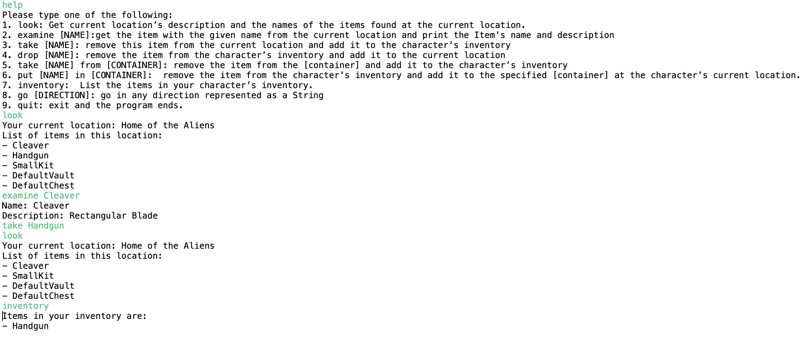

# OOPFinalProject
Applied Object-Oriented Software Development principles and concepts into the creation of items, container items, and location classes, allowing user’s interaction through commands like go north, take, inventory, etc. 

